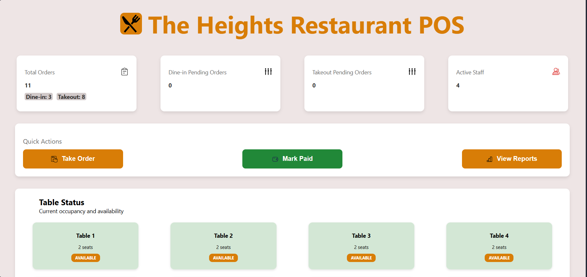
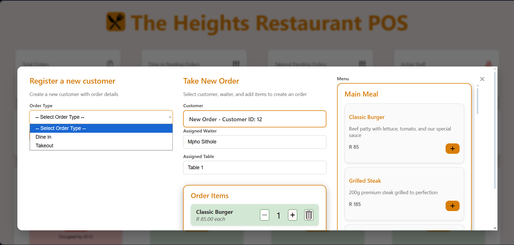
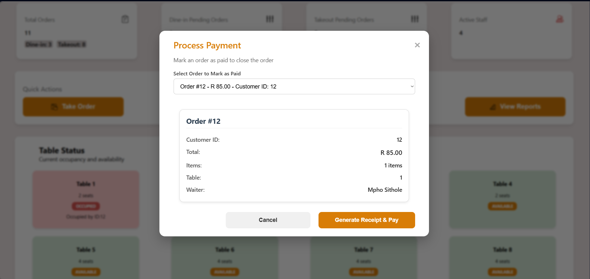
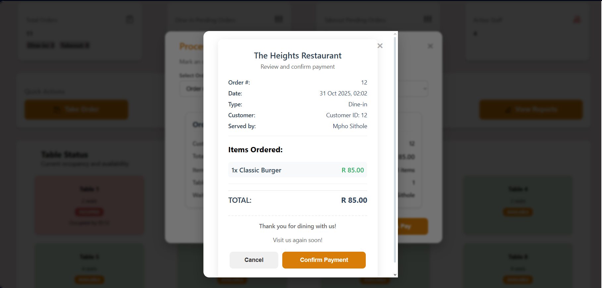
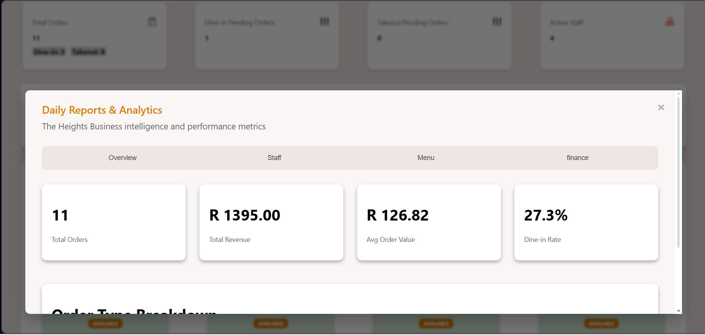

# 🍽️ The Heights Restaurant POS

A modern **Restaurant Management Dashboard** built with **HTML, CSS, JavaScript, and Java (Spring Boot)**.  
This system is designed to help restaurant staff efficiently manage tables, take orders, track pending orders, mark payments, and generate detailed reports — all with a clean, responsive user interface.

---

## Table of Contents

- [Project Overview](#project-overview)  
- [Features](#features)  
- [Screenshots](#screenshots)  
- [Technologies Used](#technologies-used)  
- [Getting Started](#getting-started)  
- [Usage](#usage)  
- [Folder Structure](#folder-structure)  
- [Future Improvements](#future-improvements)  
- [Contributing](#contributing)  
- [FAQs](#faqs)  
- [License](#license)  
- [About](#about)  
- [Contact](#contact)  

---

## Project Overview

The Heights Restaurant POS is a full-stack application designed for **efficient restaurant operations**.  
Staff can:  

- Track dine-in and takeout orders  
- Monitor table availability in real-time  
- Manage pending orders and payments  
- Generate receipts and daily/weekly reports  

This project demonstrates practical applications of **data structures**, **algorithms**, and **full-stack CRUD operations** in a real-world setting.

---

## Features

- **Dashboard Stats:** Quick overview of orders, staff, dine-in, and takeout queues.  
- **Quick Actions:** One-click actions for taking orders, marking payments, and viewing reports.  
- **Table Management:** Interactive table layout showing which tables are **Available** or **Occupied**.  
- **Pending Orders:** Detailed tracking of all pending orders with amounts and status.  
- **Interactive Modals:** Take Orders, Mark as Paid, Receipt generation, and Reports.  
- **UI Highlights:** Responsive layout, hover effects, gradients, shadows, and color-coded statuses.  
- **Backend Integration:** Java Spring Boot handles backend operations, REST APIs, and CRUD functionality.  
- **Data Structures & Algorithms:** Uses linked lists, queues, hash maps, greedy strategies, and round-robin scheduling to efficiently manage orders.

---

## Screenshots

### Dashboard


### Take Order Modal


### Mark as Paid Modal


### Receipt


### Reports


> Add more screenshots as your project grows. You can include different modals, order flows, and report views.

---

## Technologies Used

- **Frontend:** HTML5, CSS3, JavaScript  
- **Styling:** Custom CSS with Flexbox & Grid, shadows, gradients, transitions  
- **Backend:** Java (Spring Boot), RESTful APIs  
- **Database:** Optional MySQL/PostgreSQL for future improvements  
- **Fonts:** Segoe UI, Roboto, Open Sans  
- **Tools:** VS Code, Git, Live Server  

---

## Getting Started

### Clone the Repository
```bash
git clone https://github.com/Langenidzweli/The-Heights-Restaurant-POS.git
cd The-Heights-Restaurant-POS
